# ClossApp — Armario Inteligente & Marketplace

> **Proyecto Integrador · Plan de Negocios**  
> Gestión Empresarial · Instituto Tecnológico de Saltillo (ITS)  
> Materia: Plan de Negocios

---

## ¿Qué es ClossApp?

ClossApp es una plataforma SaaS móvil-first que convierte el armario físico de una persona en un inventario digital inteligente. Mediante visión artificial, organiza automáticamente cada prenda, sugiere outfits personalizados y habilita un ecosistema de compra-venta y renta entre usuarios — todo desde el teléfono, sin entrada manual de datos.

---

## 1. El Problema

> *"Tengo ropa y no sé qué ponerme."*

Este es uno de los problemas cotidianos más universales entre mujeres de 18 a 40 años, y tiene un costo real:

- **Tiempo perdido** eligiendo outfits cada mañana.
- **Dinero desperdiciado** en prendas que se compran y nunca se usan.
- **Oportunidad de ingreso desaprovechada**: vestidos de noche y accesorios de lujo que duermen en el clóset y podrían generar dinero.
- **Fricción de adopción tecnológica**: las apps existentes requieren que el usuario etiquete, categorice y describa cada prenda manualmente — nadie lo hace.

---

## 2. La Solución

ClossApp elimina la fricción con un flujo de tres pasos:

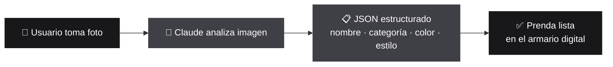

**Cero formularios. Cero etiquetas manuales.**

---

## 3. Propuesta de Valor

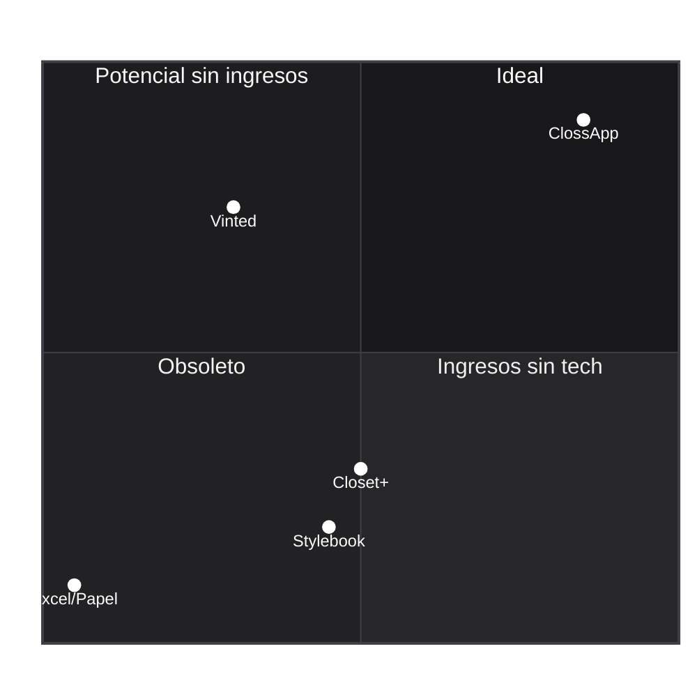

| Dimensión | Modelo Tradicional | ClossApp |
|---|---|---|
| Organización del armario | Manual, en papel o memoria | Digital, automática con IA |
| Sugerencias de outfit | Amiga, revista, intuición | Motor de IA personalizado por clima y ocasión |
| Monetización de prendas | Venta en grupos de Facebook | Marketplace integrado con flujo de compra y renta |
| Entrada de datos | El usuario escribe todo | La IA lo hace por ti (foto → JSON) |
| Acceso | Ninguno / apps genéricas | App móvil nativa (iOS-first) |

---

## 4. Modelo de Negocio

ClossApp opera bajo un modelo **SaaS híbrido con tres fuentes de ingreso**:

### 4.1 Fuentes de Ingreso

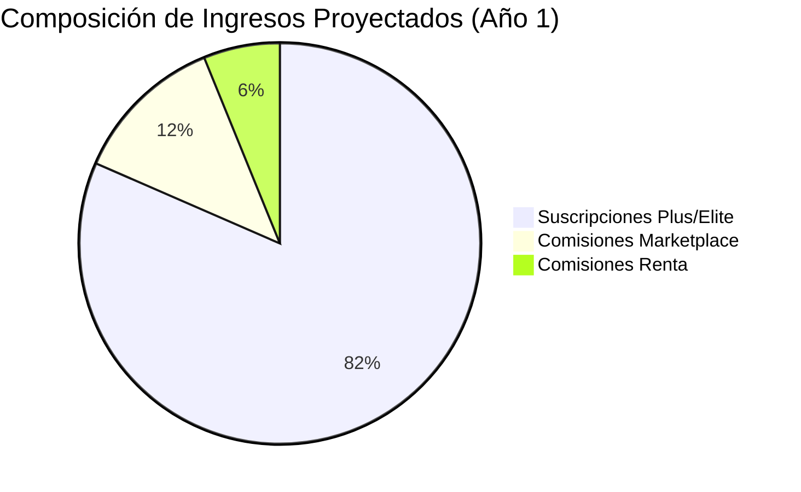

### 4.2 Planes de Suscripción

```mermaid
%%{init: {"theme": "base"}}%%
block-beta
  columns 3
  block:esencial["🆓 Esencial\n$0 MXN/mes"]:1
    e1["Hasta 50 prendas"]
    e2["Marketplace básico"]
    e3["Sin IA"]
  end
  block:plus["⭐ Plus\n$59 MXN/mes"]:1
    p1["Prendas ilimitadas"]
    p2["IA ilimitada"]
    p3["Estadísticas avanzadas"]
  end
  block:elite["💎 Elite\n$89 MXN/mes"]:1
    el1["Todo lo de Plus"]
    el2["Reportes de tendencias"]
    el3["Soporte prioritario"]
  end
```

### 4.3 Comisiones por Transacción

- **Venta entre usuarios**: comisión del 8–12% sobre cada transacción completada en el Marketplace.
- **Renta de prendas**: comisión del 15% sobre cada renta confirmada (vestidos de noche y accesorios).

### 4.4 Reglas de Negocio Estrictas — Validación de Renta

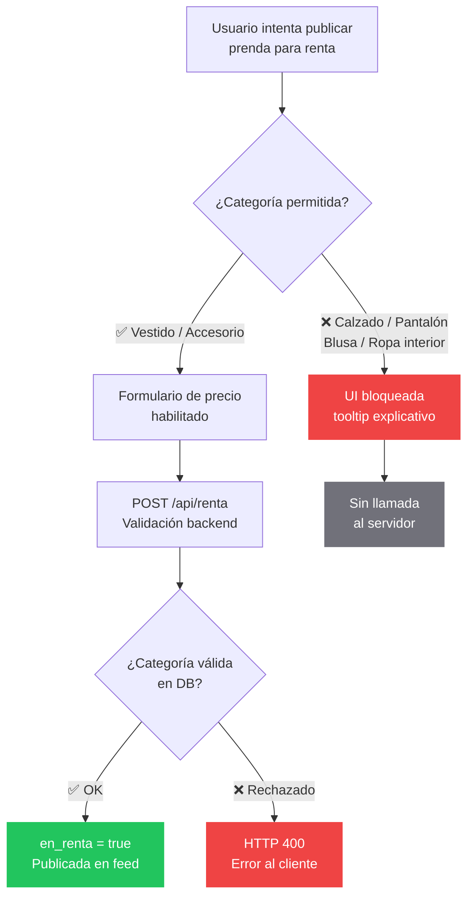

---

## 5. Arquitectura Técnica

### Stack y Flujo de Datos

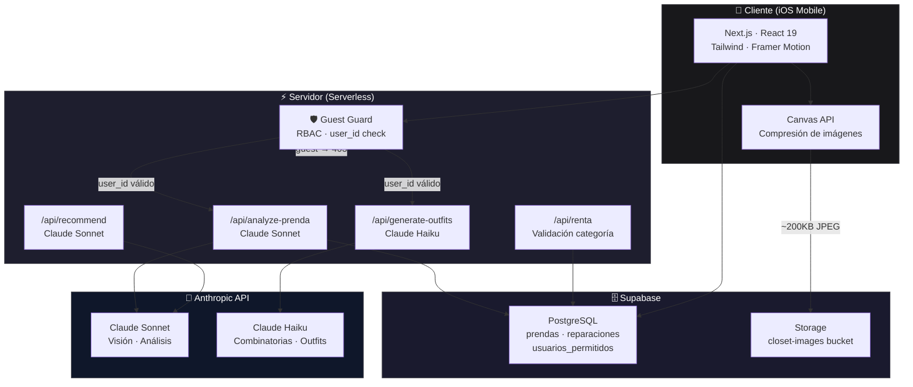

### Endpoints de IA

| Endpoint | Modelo | Función |
|---|---|---|
| `/api/analyze-prenda` | Claude Sonnet | Analiza imagen → JSON con nombre, categoría, color, estilo |
| `/api/generate-outfits` | Claude Haiku | 3 propuestas de outfit con `prenda_ids` del inventario real |
| `/api/recommend` | Claude Sonnet | Recomendaciones contextuales por clima y ocasión |
| `/api/renta` | — | Valida categoría y publica prenda para renta |

---

## 6. Optimización de Costos de Infraestructura

### 6.1 Compresión de Imágenes en el Cliente

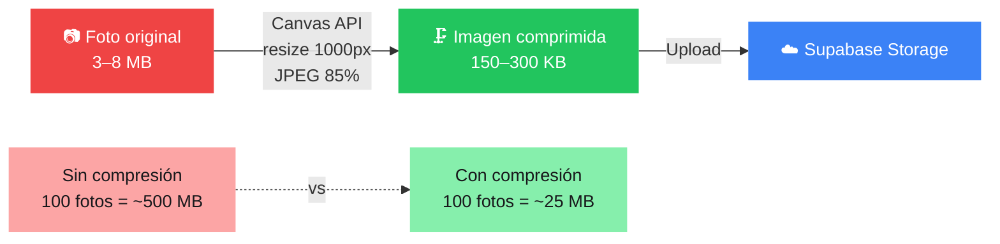

**Resultado:** Reducción del 90–95% en almacenamiento. Transferencia 10x menor por subida.

### 6.2 Guest Guard — RBAC para la API de IA

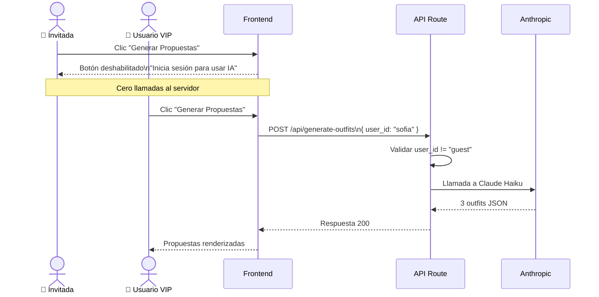

---

## 7. Esquema de Base de Datos

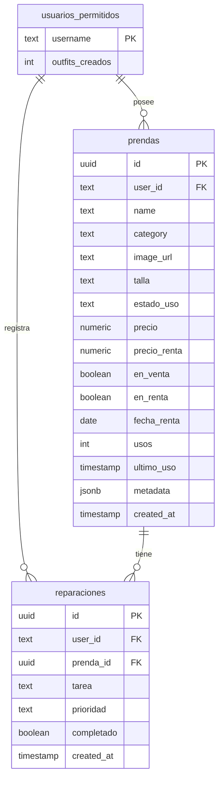

---

## 8. Flujo Completo del Usuario

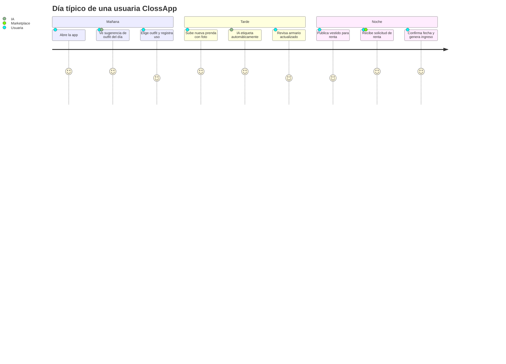

---

## 9. Análisis de Mercado

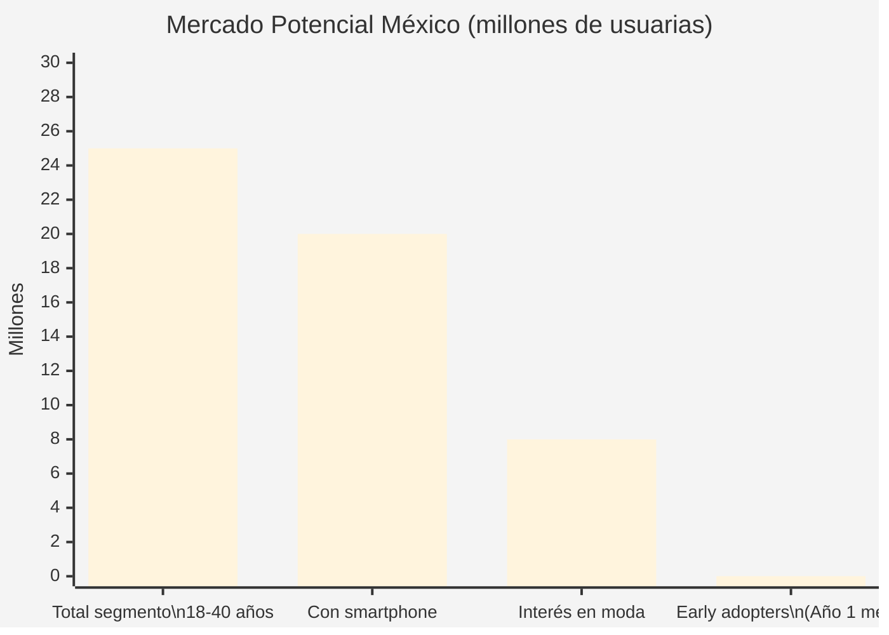

### Ventaja Competitiva

- **Ningún competidor directo en México** combina armario digital + IA + marketplace de renta en una sola app.
- La barrera de entrada es la integración de IA con el inventario personal — costosa de replicar.
- El efecto de red del Marketplace crea un moat defensible a medida que crece la base de usuarios.

---

## 10. Proyección Financiera (Año 1)

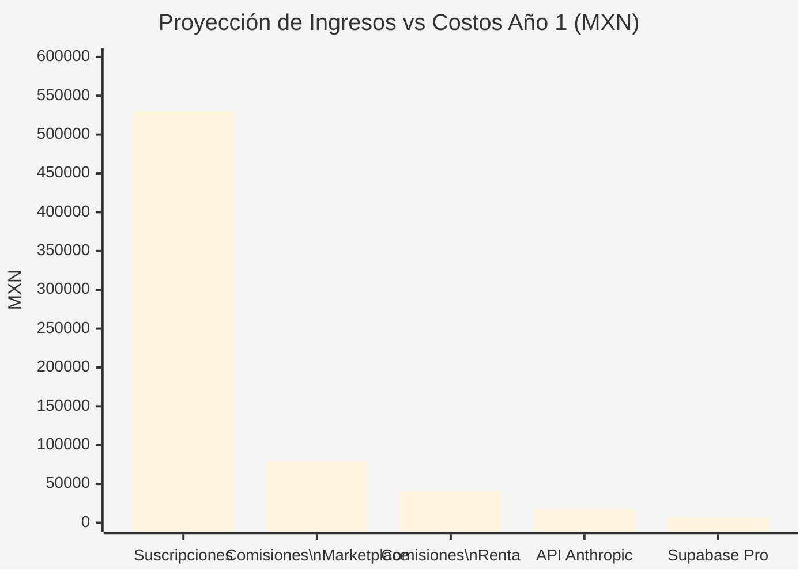

| Métrica | Meta Año 1 |
|---|---|
| Usuarios registrados | 5,000 |
| Conversión a Plan Plus/Elite | 15% → 750 usuarios |
| Ingreso por suscripciones | ~$530,000 MXN |
| Comisiones Marketplace + Renta | ~$120,000 MXN |
| **Ingreso Total Proyectado** | **~$650,000 MXN** |
| Costo API Anthropic | ~$18,000 MXN |
| Costo Supabase Pro | ~$7,200 MXN |
| **Margen Bruto Estimado** | **~95%** |

> *El margen bruto es excepcionalmente alto porque el costo marginal de servir a un usuario adicional es casi cero — característica definitoria de un negocio SaaS bien construido.*

---

## 11. Estado Actual (Fase MVP) y Roadmap

ClossApp se encuentra actualmente en fase **MVP (Producto Mínimo Viable)** para un grupo de pruebas cerrado (Closed Beta). Para priorizar la validación de las hipótesis más riesgosas del negocio (Auto-etiquetado con IA y Marketplace), algunas funciones periféricas están simuladas temporalmente:

* **Autenticación (Auth):** Actualmente el sistema utiliza un "Mock Login" (asignación directa de `user_id` en el estado de la app) para agilizar el onboarding de las usuarias fundadoras. 
* **Pasarela de Pagos:** Las rentas y ventas se acuerdan dentro de la plataforma, pero la transacción monetaria se procesa fuera de banda.

### 🚀 Roadmap (Próximas Fases)
1. **Fase 2:** Integración de Supabase Auth (Email/Password y OAuth) para el registro abierto.
2. **Fase 3:** Integración de Stripe para procesar los cobros de renta nativamente y automatizar la retención de comisiones.
3. **Fase 4:** Migración de almacenamiento de imágenes a un CDN global para reducir latencia en el feed del Marketplace.

---

## 12. Instalación y Desarrollo Local

```bash
# Clonar el repositorio
git clone https://github.com/tu-usuario/clossapp.git
cd clossapp

# Instalar dependencias
npm install

# Configurar variables de entorno
cp .env.example .env.local
# Editar .env.local con tus keys de Supabase y Anthropic

# Ejecutar en desarrollo
npm run dev
```

### Variables de Entorno Requeridas

```env
NEXT_PUBLIC_SUPABASE_URL=
NEXT_PUBLIC_SUPABASE_ANON_KEY=
ANTHROPIC_API_KEY=
```

---

## 13. Equipo

Desarrollado como Proyecto Integrador para la materia **Plan de Negocios**  
**Gestión Empresarial · Instituto Tecnológico de Saltillo (ITS)**

---

## 14. Licencia y Derechos de Autor

**© 2026 Mauricio González. Todos los derechos reservados.**

Este repositorio es público exclusivamente con fines de exhibición para portafolio profesional y como Caso de Estudio académico para el Instituto Tecnológico de Saltillo. 

Eres bienvenido a explorar el código para aprender de la arquitectura Serverless o la implementación de IA generativa. Sin embargo, este proyecto **no es de código abierto (Open Source)**. No se permite la copia, distribución, modificación, clonación para proyectos derivados, ni el uso comercial de este software sin autorización expresa.

<div align="center">

**ClossApp · ITS Saltillo · 2026**

</div>
