# ClossApp — Armario Inteligente & Marketplace

> **Proyecto Integrador · Plan de Negocios**  
> Gestión Empresarial · Instituto Tecnológico de Saltillo (ITS)  
> Materia: Plan de Negocios

---

## ¿Qué es ClossApp?

ClossApp es una plataforma SaaS móvil-first que convierte el armario físico de una persona en un inventario digital inteligente. Mediante visión artificial, organiza automáticamente cada prenda, sugiere outfits personalizados y habilita un ecosistema de compra-venta y renta entre usuarios — todo desde el teléfono, sin entrada manual de datos.

---

## 1. El Problema

> *"Tengo ropa y no sé qué ponerme."*

Este es uno de los problemas cotidianos más universales entre mujeres de 18 a 40 años, y tiene un costo real:

- **Tiempo perdido** eligiendo outfits cada mañana.
- **Dinero desperdiciado** en prendas que se compran y nunca se usan.
- **Oportunidad de ingreso desaprovechada**: vestidos de noche y accesorios de lujo que duermen en el clóset y podrían generar dinero.
- **Fricción de adopción tecnológica**: las apps existentes requieren que el usuario etiquete, categorice y describa cada prenda manualmente — nadie lo hace.

---

## 2. La Solución

ClossApp elimina la fricción con un flujo de tres pasos:

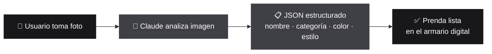

**Cero formularios. Cero etiquetas manuales.**

---

## 3. Propuesta de Valor

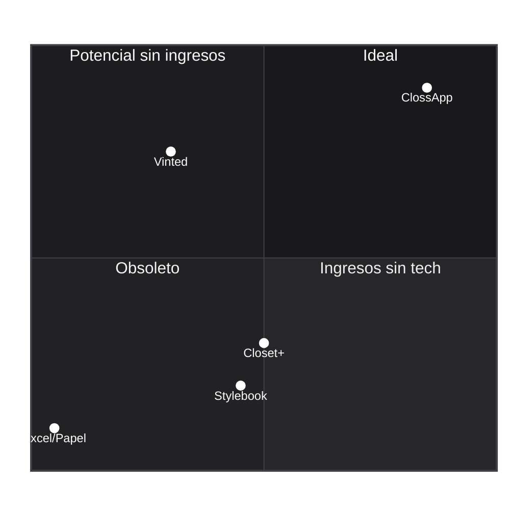

| Dimensión | Modelo Tradicional | ClossApp |
|---|---|---|
| Organización del armario | Manual, en papel o memoria | Digital, automática con IA |
| Sugerencias de outfit | Amiga, revista, intuición | Motor de IA personalizado por clima y ocasión |
| Monetización de prendas | Venta en grupos de Facebook | Marketplace integrado con flujo de compra y renta |
| Entrada de datos | El usuario escribe todo | La IA lo hace por ti (foto → JSON) |
| Acceso | Ninguno / apps genéricas | App móvil nativa (iOS-first) |

---

## 4. Modelo de Negocio

ClossApp opera bajo un modelo **SaaS híbrido con tres fuentes de ingreso**:

### 4.1 Fuentes de Ingreso

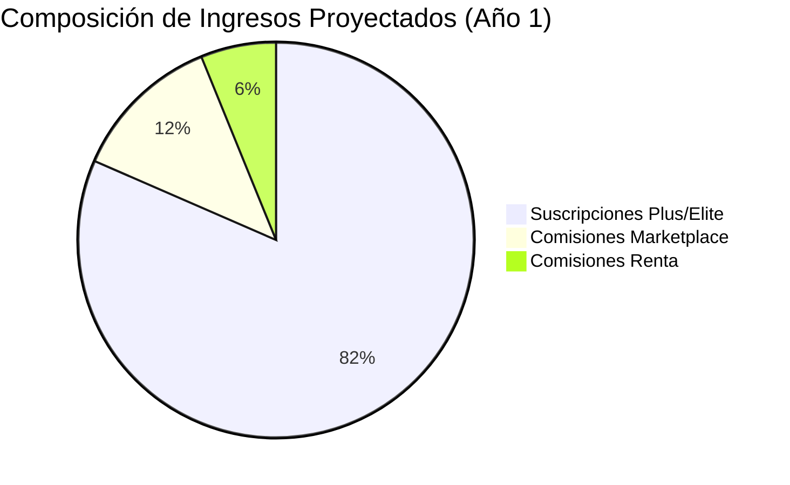

### 4.2 Planes de Suscripción

```mermaid
%%{init: {"theme": "base"}}%%
block-beta
  columns 3
  block:esencial["🆓 Esencial\n$0 MXN/mes"]:1
    e1["Hasta 50 prendas"]
    e2["Marketplace básico"]
    e3["Sin IA"]
  end
  block:plus["⭐ Plus\n$59 MXN/mes"]:1
    p1["Prendas ilimitadas"]
    p2["IA ilimitada"]
    p3["Estadísticas avanzadas"]
  end
  block:elite["💎 Elite\n$89 MXN/mes"]:1
    el1["Todo lo de Plus"]
    el2["Reportes de tendencias"]
    el3["Soporte prioritario"]
  end
```

### 4.3 Comisiones por Transacción

- **Venta entre usuarios**: comisión del 8–12% sobre cada transacción completada en el Marketplace.
- **Renta de prendas**: comisión del 15% sobre cada renta confirmada (vestidos de noche y accesorios).

### 4.4 Reglas de Negocio Estrictas — Validación de Renta

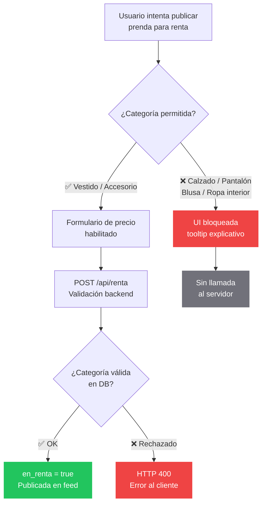

Las categorías habilitadas y bloqueadas para renta están definidas en `constants/categories.ts` (`CATEGORIAS_RENTA`) y se validan tanto en el frontend (botón deshabilitado + tooltip) como en el backend (`/api/renta`):

| Permitidas para renta | Bloqueadas para renta |
|---|---|
| Vestidos | Calzado |
| Accesorios | Pantalones |
| | Blusas |
| | Ropa interior |

---

## 5. Arquitectura Técnica

### Stack Tecnológico

| Capa | Tecnología |
|---|---|
| Framework | Next.js 16 (App Router) + React 19 |
| Lenguaje | TypeScript (strict mode) |
| Estilos | Tailwind CSS v4 + `tw-animate-css` |
| Componentes | shadcn/ui (new-york) + Radix UI + Lucide |
| Animaciones | Framer Motion |
| Backend | Supabase (PostgreSQL + Storage + Auth) |
| IA | Anthropic SDK — Claude Sonnet 4.6 (visión) + Claude Haiku (outfits) |
| Hosting | Vercel (serverless) |
| Tipografía | Geist + Geist Mono (next/font/google) |

### Estructura del Proyecto

```
clossapp/
├── app/                        # App Router — page.tsx + layout + api routes
│   ├── page.tsx                # Wrapper con dynamic = 'force-dynamic'
│   └── api/
│       ├── analyze-prenda/     # Claude Sonnet: imagen → JSON
│       ├── generate-outfits/   # Claude Haiku: 3 outfits con prenda_ids
│       ├── recommend/          # Claude Sonnet: recomendaciones contextuales
│       └── renta/              # Validación de categoría + publicación
│
├── components/
│   ├── clossapp-dashboard.tsx  # Shell: AuthProvider → PrendasProvider → AppShell
│   ├── shared/                 # 7 componentes UI reutilizables
│   │   ├── bottom-nav.tsx          # Navegación inferior fija con iconos
│   │   ├── centered-modal.tsx      # Modal genérico
│   │   ├── page-header.tsx         # Título de vista + acción opcional
│   │   ├── prenda-card.tsx         # Tarjeta individual de prenda
│   │   ├── prenda-grid.tsx         # Grid responsive de tarjetas
│   │   ├── prenda-skeleton.tsx     # Placeholder de carga
│   │   └── animated-number.tsx     # Contador animado
│   └── views/                  # 20 vistas organizadas en 6 secciones
│       ├── login-view.tsx
│       ├── inicio/inicio-view.tsx
│       ├── armario/{armario-view,upload-modal,prenda-detail-modal,repair-form-modal,repair-list}.tsx
│       ├── simulador/{simulador-view,outfit-form,outfit-card,outfit-visual}.tsx
│       ├── marketplace/{marketplace-view,market-item-card,item-detail-modal,sell-form-modal,rent-date-picker}.tsx
│       └── estadisticas/{estadisticas-view,kpi-grid,top-prendas-list,forgotten-prendas-list}.tsx
│
├── context/                    # React Context (state management)
│   ├── auth-context.tsx        # AuthProvider + useAuthContext (userMode, userId, user, isGuest)
│   └── prendas-context.tsx     # PrendasProvider + usePrendasContext (prendas, refresh, loading)
│
├── hooks/                      # 8 hooks personalizados (lógica de negocio)
│   ├── use-auth.ts             # Demo mock + login real con Supabase
│   ├── use-keyboard.ts         # Detección de teclado móvil
│   ├── use-prendas.ts          # CRUD de prendas
│   ├── use-reparaciones.ts     # CRUD de reparaciones
│   ├── use-image-upload.ts     # Canvas resize + upload a Supabase Storage
│   ├── use-outfits.ts          # Generación de outfits vía /api/generate-outfits
│   ├── use-marketplace.ts      # Mutaciones de venta/renta vía /api/renta
│   └── use-stats.ts            # Estadísticas de uso y frecuencia
│
├── services/                   # 8 servicios (capa de acceso a datos)
│   ├── image.service.ts        # Compresión de imágenes con Canvas API
│   ├── prendas.service.ts      # Queries a tabla prendas
│   ├── auth.service.ts         # Sign in/up/signOut + verificación de username
│   ├── analyze.service.ts      # Análisis de imagen con Claude Sonnet
│   ├── outfits.service.ts      # Llamada a API de generación de outfits
│   ├── reparaciones.service.ts # Queries a tabla reparaciones
│   ├── marketplace.service.ts  # Listados de mercado + renta API
│   └── stats.service.ts        # Queries de estadísticas de uso
│
├── types/                      # Tipos y interfaces TypeScript
│   ├── prenda.ts               # Prenda, PrendaExt
│   ├── reparacion.ts           # ReparacionDB
│   ├── outfit.ts               # OutfitRec
│   ├── auth.ts                 # UserMode
│   ├── views.ts                # View (union type de IDs de vista)
│   └── index.ts                # Re-exporta todos los tipos
│
├── constants/                  # Datos estáticos y de demostración
│   ├── demo-data.ts            # GUEST_PRENDAS, GUEST_REPARACIONES, DEMO_OUTFITS
│   ├── navigation.ts           # navItems, filterChips
│   ├── categories.ts           # FIXED_CATS, CATEGORIAS_RENTA, LAYER_ORDER
│   ├── images.ts               # fashionImages, outfitImages
│   └── animation.ts            # pageVariants, pageProps
│
├── lib/                        # Utilidades (cn, formatters, etc.)
├── utils/supabase/             # Clientes Supabase (browser + server)
├── middleware.ts               # Refresh de sesión en cada navegación
└── AGENTS.md                   # Documentación interna para agentes de IA
```

### Flujo de Datos

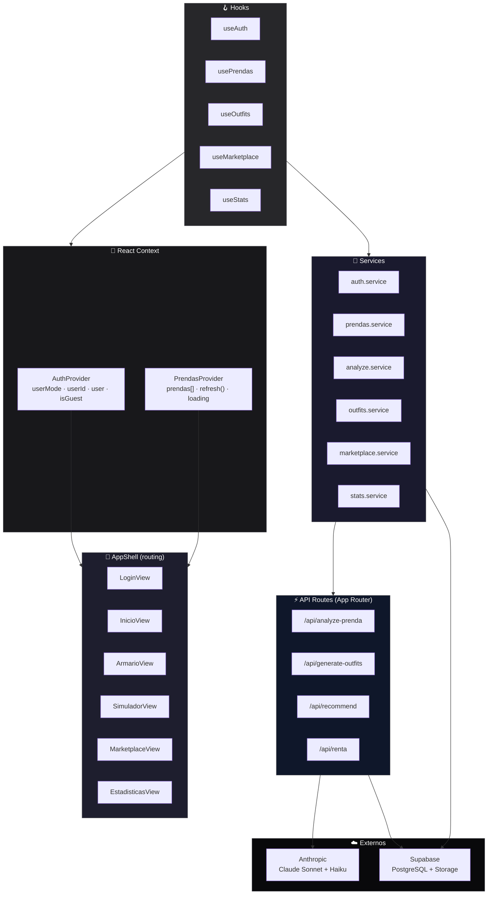

**Patrón de datos:** Todas las vistas consumen estado vía `useAuthContext()` / `usePrendasContext()` — cero props desde `AppShell` (excepto callbacks de navegación para `onElegir`, `onApartar`, `onSellPrenda`).

Los servicios reciben `SupabaseClient` como parámetro (inyección de dependencias) para futura portabilidad a React Native. No hay fetching SSR/RSC — todos los datos se obtienen del lado del cliente vía Supabase browser client.

### API Routes

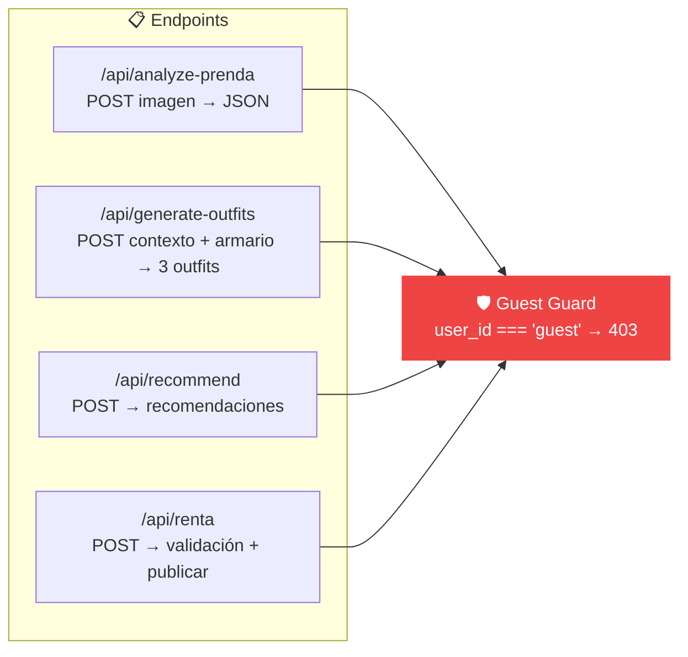

| Endpoint | Modelo | Input | Output |
|---|---|---|---|
| `/api/analyze-prenda` | Claude Sonnet 4.6 | Imagen (JPEG ~200KB) | `{ name, category, color, style, description }` |
| `/api/generate-outfits` | Claude Haiku | Contexto + `prenda_ids[]` del armario | 3 outfits con combinaciones de prendas |
| `/api/recommend` | Claude Sonnet | Contexto del usuario | Recomendaciones personalizadas |
| `/api/renta` | — | `{ prenda_id, category, precio_renta }` | `en_renta = true` en DB |

### Sistema de Autenticación Dual

ClossApp maneja **dos modos de autenticación que coexisten** en el mismo flujo:

| Modo | Descripción | Datos |
|---|---|---|
| **Guest (invitado)** | Acceso sin registro, datos de demostración precargados | `GUEST_PRENDAS`, `GUEST_REPARACIONES`, `DEMO_OUTFITS` desde `constants/demo-data.ts` |
| **Real (Supabase Auth)** | Email/password contra Supabase | `use-auth.ts` maneja `signIn`, `signUp`, `signOut` vía `auth.service.ts` |

- El `AuthProvider` (`context/auth-context.tsx`) expone `isGuest: boolean` para que toda la app sepa en qué modo está.
- El **Guest Guard** en cada API route rechaza `user_id === "guest"` con HTTP 403 — los invitados nunca tocan los endpoints de IA.
- En modo guest, `LoginView` se salta y se pasa directo a `InicioView` con los datos demo.
- `LoginView` ya tiene el formulario completo de email/password listo para activarse al abrir el registro.

### Sistema de Navegación

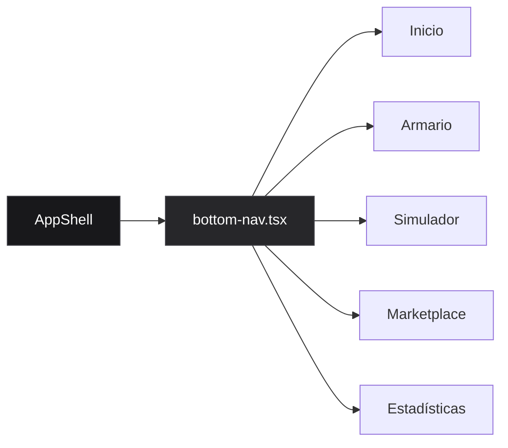

- `AppShell` (dentro de `clossapp-dashboard.tsx`) es el router central: mantiene un `activeView` en estado local y renderiza condicionalmente la vista activa.
- `bottom-nav.tsx` (`components/shared/`) es la barra de navegación inferior fija con 5 iconos (Lucide). Cada ícono cambia `activeView` mediante callbacks.
- Las vistas no reciben props de AppShell — solo consumen `useAuthContext()` y `usePrendasContext()`. Los callbacks de acción (`onElegir`, `onApartar`, `onSellPrenda`) son las únicas props que pasan entre vistas para flujos cruzados (ej: elegir un outfit desde el Simulador y registrarlo en el Armario).

### Vistas / Módulos de la App

| Vista | Archivo(s) | Funcionalidad |
|---|---|---|
| **Login** | `login-view.tsx` | Formulario email/password + opción "Entrar como invitada" con datos demo |
| **Inicio** | `inicio/inicio-view.tsx` | Dashboard: bienvenida, últimas prendas agregadas, recomendaciones IA del día |
| **Armario** | `armario/` (5 archivos) | Grid del clóset digital con filtros por categoría. Upload de prendas con foto → análisis IA → guardado automático. Detalle de prenda con edición. Gestión de reparaciones (crear tarea, checklist, prioridad) |
| **Simulador** | `simulador/` (4 archivos) | Generación de outfits: el usuario selecciona ocasión, clima y estilo → Claude Haiku propone 3 combinaciones usando solo prendas del inventario real. Visualización de cada outfit con las prendas que lo componen |
| **Marketplace** | `marketplace/` (5 archivos) | Feed de prendas en venta/renta de otras usuarias. Publicación de prenda propia (precio, fecha de renta). Date picker para reservar rentas. Solo vestidos y accesorios habilitados para renta |
| **Estadísticas** | `estadisticas/` (4 archivos) | KPIs (prendas totales, usos este mes, prendas sin usar). Ranking de prendas más usadas. Lista de prendas olvidadas (sin uso en 30+ días). Gráficos de frecuencia por categoría |

### Middleware

`middleware.ts` (raíz del proyecto) se ejecuta en cada navegación del lado del servidor. Su única función es refrescar la sesión de Supabase:

- Usa `createServerClient` con las cookies de `next/headers` para leer la sesión actual.
- Llama a `supabase.auth.getUser()` para validar y renovar el token si está por expirar.
- Esto mantiene la sesión viva sin que el frontend tenga que hacer polling.

### Tipos de Datos Principales

Definidos en `types/` y re-exportados desde `types/index.ts`:

| Tipo | Archivo | Campos clave |
|---|---|---|
| `Prenda` | `prenda.ts` | `id, user_id, name, category, image_url, talla, estado_uso, precio, precio_renta, en_venta, en_renta, usos, ultimo_uso, metadata` |
| `PrendaExt` | `prenda.ts` | Extiende `Prenda` con campos calculados: `diasSinUsar`, `estaEnRenta`, etc. |
| `OutfitRec` | `outfit.ts` | `nombre, ocasion, clima, prenda_ids[], descripcion` — una propuesta de outfit generada por IA |
| `ReparacionDB` | `reparacion.ts` | `id, user_id, prenda_id, tarea, prioridad, completado` |
| `UserMode` | `auth.ts` | `"guest" | "authenticated"` — discrimina el modo de autenticación |
| `View` | `views.ts` | Union type: `"login" | "inicio" | "armario" | "simulador" | "marketplace" | "estadisticas"` |

---

## 6. Optimización de Costos de Infraestructura

### 6.1 Compresión de Imágenes en el Cliente

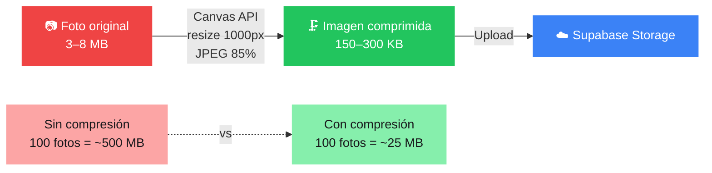

**Resultado:** Reducción del 90–95% en almacenamiento. Transferencia 10x menor por subida.

### 6.2 Guest Guard — RBAC para la API de IA

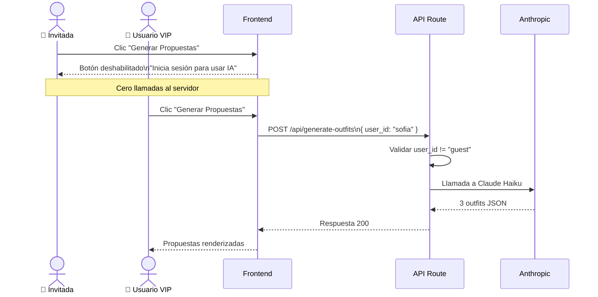

---

## 7. Esquema de Base de Datos (Supabase PostgreSQL)

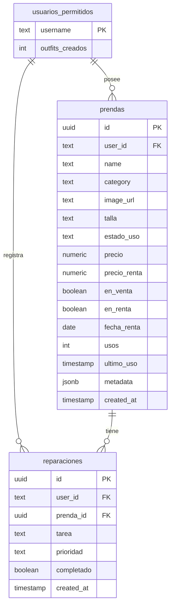

### Funciones RPC (PostgreSQL)

| Función | Parámetro | Descripción |
|---|---|---|
| `incrementar_uso(prenda_id_input)` | `uuid` | Incrementa el contador de usos y actualiza `ultimo_uso` |
| `incrementar_outfits(username_input)` | `text` | Incrementa el contador de outfits creados del usuario |

### Storage

- **Bucket:** `closet-images` — almacena las imágenes de prendas comprimidas (1000px / JPEG 85%)
- Las imágenes se comprimen del lado del cliente con Canvas API antes de subir (3–8 MB → 150–300 KB)
- Las imágenes enviadas a la API de Anthropic se comprimen adicionalmente (800px / JPEG 70%) por el límite de 4.5 MB de Vercel

---

## 8. Flujo Completo del Usuario

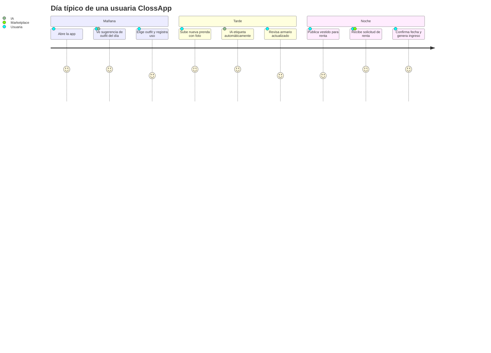

---

## 9. Análisis de Mercado

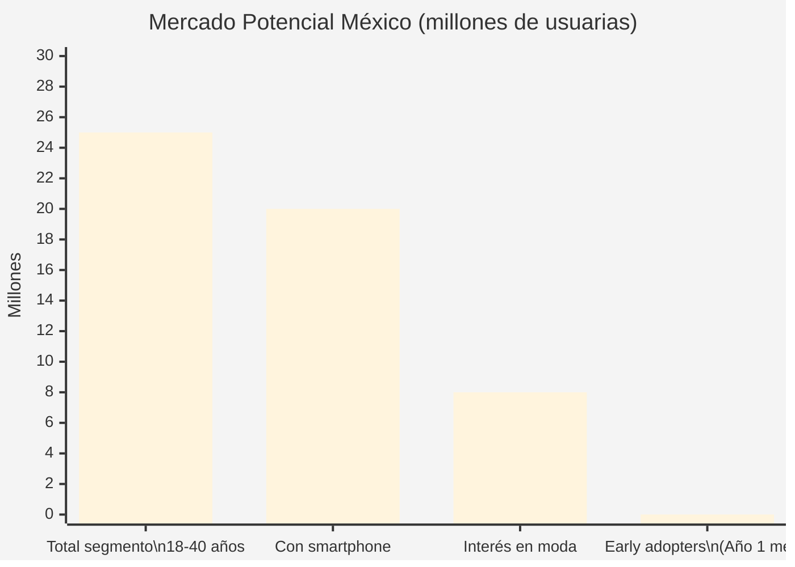

### Ventaja Competitiva

- **Ningún competidor directo en México** combina armario digital + IA + marketplace de renta en una sola app.
- La barrera de entrada es la integración de IA con el inventario personal — costosa de replicar.
- El efecto de red del Marketplace crea un moat defensible a medida que crece la base de usuarios.

---

## 10. Proyección Financiera (Año 1)

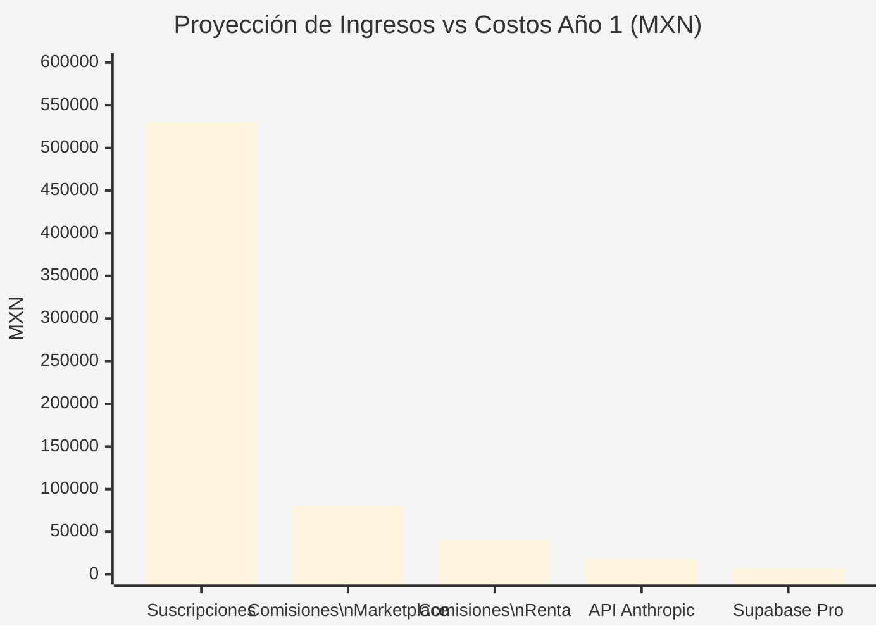

| Métrica | Meta Año 1 |
|---|---|
| Usuarios registrados | 5,000 |
| Conversión a Plan Plus/Elite | 15% → 750 usuarios |
| Ingreso por suscripciones | ~$530,000 MXN |
| Comisiones Marketplace + Renta | ~$120,000 MXN |
| **Ingreso Total Proyectado** | **~$650,000 MXN** |
| Costo API Anthropic | ~$18,000 MXN |
| Costo Supabase Pro | ~$7,200 MXN |
| **Margen Bruto Estimado** | **~95%** |

> *El margen bruto es excepcionalmente alto porque el costo marginal de servir a un usuario adicional es casi cero — característica definitoria de un negocio SaaS bien construido.*

---

## 11. Estado Actual (Fase MVP) y Roadmap

ClossApp se encuentra en fase **MVP (Producto Mínimo Viable)** para un grupo de pruebas cerrado (Closed Beta). La arquitectura ha sido refactorizada a una estructura modular con separación clara de responsabilidades:

| Capa | Responsabilidad | Archivos |
|---|---|---|
| `components/shared/` | UI reutilizable | 7 componentes (bottom-nav, modals, cards, grid, skeleton) |
| `components/views/` | Vistas de negocio | 20 componentes en 6 secciones (login, inicio, armario, simulador, marketplace, estadisticas) |
| `context/` | Estado global | AuthProvider + PrendasProvider |
| `hooks/` | Lógica de negocio | 8 hooks (auth, prendas, outfits, marketplace, stats, keyboard, image-upload, reparaciones) |
| `services/` | Acceso a datos | 8 servicios con dependency injection de SupabaseClient (portabilidad React Native) |

Para priorizar la validación de las hipótesis más riesgosas del negocio (Auto-etiquetado con IA y Marketplace), algunas funciones periféricas están simuladas temporalmente:

* **Autenticación (Auth):** El sistema utiliza un "Mock Login" para agilizar el onboarding. La UI de `LoginView` ya incluye el formulario de email/password con Supabase Auth listo para activarse.
* **Pasarela de Pagos:** Las rentas y ventas se acuerdan dentro de la plataforma, pero la transacción monetaria se procesa fuera de banda.

### 🚀 Roadmap (Próximas Fases)
1. **Fase 2:** Activación completa de Supabase Auth (Email/Password y OAuth) para registro abierto.
2. **Fase 3:** Integración de Stripe para procesar cobros de renta nativamente y automatizar la retención de comisiones.
3. **Fase 4:** Migración de almacenamiento de imágenes a un CDN global para reducir latencia en el feed del Marketplace.

---

## 12. Instalación y Desarrollo Local

```bash
# Clonar el repositorio
git clone https://github.com/tu-usuario/clossapp.git
cd clossapp

# Instalar dependencias
npm install

# Configurar variables de entorno
# Crea .env.local con tus keys (no existe .env.example — ver tabla abajo)
touch .env.local

# Ejecutar en desarrollo
npm run dev

# Linting
npm run lint

# Build de producción
npm run build
```

> **Nota:** `next.config.mjs` tiene `typescript.ignoreBuildErrors: true`, por lo que `npm run build` no falla por errores de TypeScript. Siempre ejecuta `npm run lint` por separado para validar tipos.

### Variables de Entorno Requeridas

Crea un archivo `.env.local` en la raíz con estas variables:

```env
NEXT_PUBLIC_SUPABASE_URL=
NEXT_PUBLIC_SUPABASE_ANON_KEY=
ANTHROPIC_API_KEY=
```

No se requiere ninguna otra variable. No existe `.env.example` en el repositorio.

---

## 13. Equipo

Desarrollado como Proyecto Integrador para la materia **Plan de Negocios**  
**Gestión Empresarial · Instituto Tecnológico de Saltillo (ITS)**

---

## 14. Licencia y Derechos de Autor

**© 2026 Mauricio González. Todos los derechos reservados.**

Este repositorio es público exclusivamente con fines de exhibición para portafolio profesional y como Caso de Estudio académico para el Instituto Tecnológico de Saltillo. 

Eres bienvenido a explorar el código para aprender de la arquitectura Serverless o la implementación de IA generativa. Sin embargo, este proyecto **no es de código abierto (Open Source)**. No se permite la copia, distribución, modificación, clonación para proyectos derivados, ni el uso comercial de este software sin autorización expresa.

<div align="center">

**ClossApp · ITS Saltillo · 2026**

</div>
